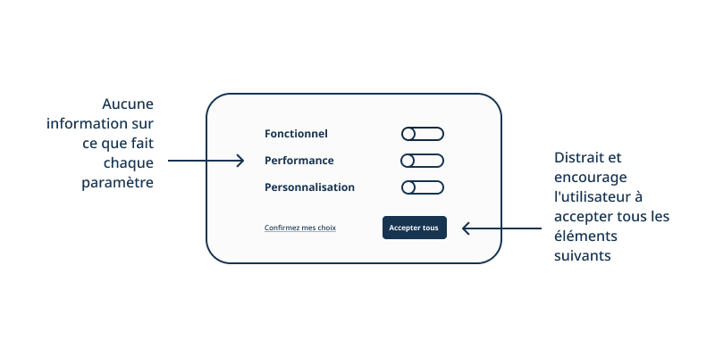
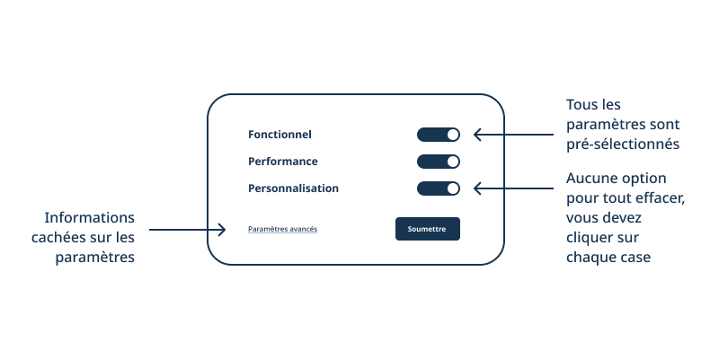
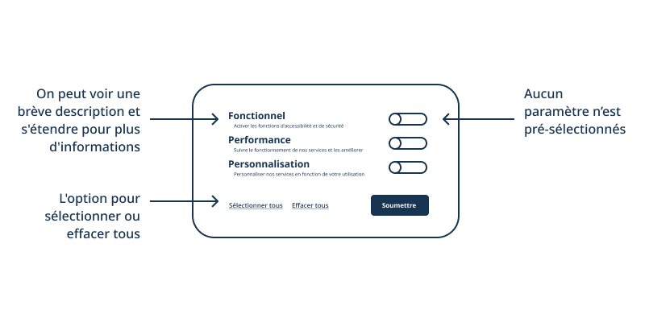

## Que sont les modèles de données ?

Les modèles sont comme des blocs de construction pour la conception de services.
En créant des modèles, nous créons une façon répétitive de faire quelque chose.
Nous pouvons nous assurer que l'apparence, la sensation et le fonctionnement de quelque chose sont identiques, de sorte que nous comprenons clairement ce que nous faisons, quel que soit le moment ou l'endroit où nous le faisons.

Les modèles de données se concentrent sur les interactions répétitives impliquant des flux de données, comme le fait de donner ou de retirer son consentement, d'accéder à des données ou de comprendre une décision automatisée.
Les modèles de données rassemblent des éléments de conception, de technique et de politique afin de donner une vue d'ensemble de ce qui se passe avec les données des personnes, du front-end au back-end, et inversement.

## Pourquoi les modèles de données sont-ils importants?

Les modèles de données peuvent nous aider à renforcer la confiance avec les utilisateurs en garantissant que nos services numériques sont privés, sûrs et équitables par conception.

Pour les **utilisateurs** (les personnes qui utilisent nos services), il est essentiel de pouvoir comprendre comment nos services fonctionnent et utilisent les données pour prendre des décisions éclairées pour eux-mêmes ou pour les personnes dont ils s'occupent.

Pour les **équipes** (les personnes qui créent nos services), la possibilité de réutiliser et d'adapter les composants de manière responsable facilite la création des meilleurs services possibles, c'est-à-dire des services qui suivent systématiquementles règles ou les meilleures pratiques et qui fonctionnent les uns avec les autres afinde répondre aux besoins des utilisateurs.

### Éviter les designs trompeurs (dark patterns)

Travailler avec les utilisateurs pour développer des modèles de données fiables peut également nous aider à éviter les dark patterns.

Les [dark patterns](https://fr.wikipedia.org/wiki/Dark_pattern) sont des "astuces utilisées dans les sites web et les applications qui vous font faire des choses que vous n'aviez pas l'intention de faire, comme acheter ou vous inscrire à quelque chose". Ils utilisent le [pouvoir du design](https://dapde.de/en/) pour que les propriétaires ou les créateurs d'un produit en profitent davantage que les personnes qui l'utilisent.

Les dark patterns peuvent y parvenir de nombreuses façons différentes, mais principalement en limitant:

* **Le consentement** - la possibilité pour les personnes de choisir les données qu'ellesveulent ou ne veulent pas collectées, utilisées, stockées ou partagées.
* **L’ouverture** - la possibilité pour les personnes de voir, de comprendre et de participer à la conception et au fonctionnement d'un service.
* **Responsabilité** - la capacité de donner, de recevoir et de répondre aux commentaires.

#### Exemple – cookies pop-ups

Par exemple, nous sommes [tenus par la loi](https://laws-lois.justice.gc.ca/fra/lois/p-21/TexteComplet.html) de demander le consentement des personnes lorsque nous souhaitons collecter des données via des cookies. Pour ce faire, nous demandons souvent aux gens de donner leur consentement par l'intermédiaire d'une fenêtre contextuelle sur les cookies.

Bien que la loi nous oblige à demander l'autorisation de collecter des informations personnelles, il est recommandé de demander aux internautes s'ils sont d'accord avec d'autres types de collecte de données, y compris l'utilisation de cookies. Pour ce faire, les sites Web demandent souvent aux internautes de consentir à la collectede données par le biais d'une fenêtre contextuelle de cookies.

Un dark pattern pour une fenêtre contextuelle de cookies peut vous amener à partager plus de données que vous ne le souhaitez en supposant que vous voulez consentir à tous les cookies, puis en rendant difficile la modification de vos préférences.

L'un des moyens d'y parvenir est de recourir à des designs trompeurs tels que la **fausse direction**, où un élément visuel tel qu'un bouton est utilisé pour détourner l'attention du contenu et amener l'utilisateur à effectuer une action qu'il n'aurait peut-être pas autrement.

Une autre façon de procéder consiste à combiner des modèles d'obstruction, notamment:

* **La présélection**- lorsque les options de paramètres sont sélectionnées par défaut.
* **La fatigue du clic**- lorsque l'utilisateur est amené à accepter un chemin par défaut ou facile en créant des chemins de clics de longueurs et d'efforts différents.
* **Informations cachées**- lorsque des options ou des détails utiles sont cachés ou difficiles d'accès.

Nos modèles de données visent à contrer les dark patterns en soutenant et en élargissant le consentement, l'ouverture et la responsabilité plutôt que les restreindre.

Voici quelques moyens d'y parvenir:

* Rendre les informations **accessibles**, avec **différents niveaux de détail**.
* **Ne pas présélectionner les options** ou faire des hypothèses par défaut, à moins qu'elles ne soient validées par les besoins de l'utilisateur.
* Proposer des options en un ou deux clics pour modifier les paramètres **enbloc** et des options pour modifier les paramètres **individuels**.

Le plus important, c’est que nous pouvons éviter les dark patterns et créer des modèles plus éthiques et plus autonomes en concevant avec les utilisateurs. Ainsi, notre seul défaut est de veiller à ce que leurs divers besoins soient exprimés et satisfaits tout au long du processus de développement, d'utilisation et d'amélioration de nos services.

## Comment puis-je utiliser un modèle ?

Les différents composants du modèle sont destinés à différents utilisateurs (concepteurs de services, développeurs, experts en politique, chercheurs, etc.), généralement au sein d'une équipe.

Consultez notre [template (sur GitHub)](https://github.com/DTS-STN/Data-Patterns/blob/main/_patterns/_template.md) pour obtenir des descriptions de ces composants ou des conseils pour commencer à développer votre propre modèle.

Avant d'utiliser un modèle, vous devriez également vérifier l'état du modèle via `{{ page.status }}` ou la bannière d'alerte sous le titre du modèle sur une page web.

Si un modèle est **en développement**, cela signifie qu'il s'agit d'une idée émergente et que nous sommes encore en train de réfléchir à la manière de l'implémenter.
Nous vous encourageons à le tester et à nous faire part de vos commentaires pour qu'il soit prêt à être utilisé.

Si le modèle est en **cours d'utilisation**, cela veut dire qu’il fait déjà partie de nos services et qu’il est prêt à être réutilisée dans d'autres contextes.
Nous vous encourageons à l'utiliser, à mesurer son fonctionnement et à partager vos commentaires pour l'améliorer.
