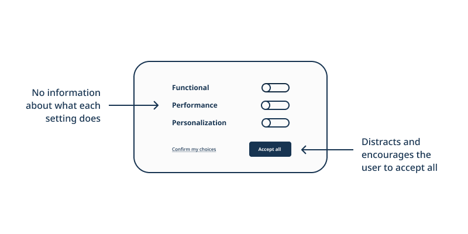
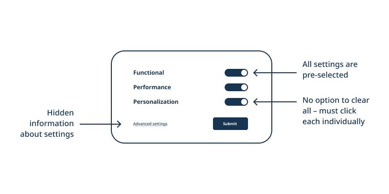
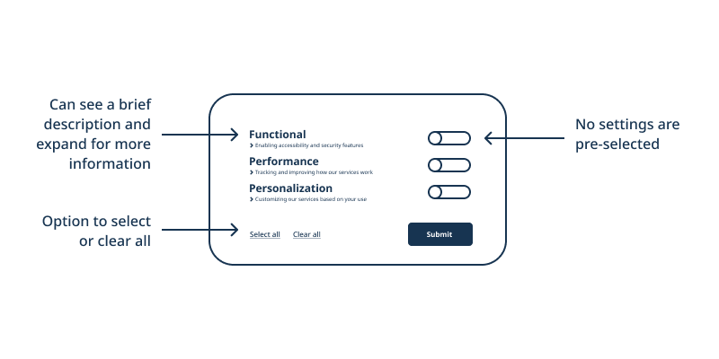

## What are data patterns?

Patterns are like building blocks for service design.
By creating patterns, we create a repeatable way of doing something.
We can make sure something looks, feels, and functions the same way, so we clearly understand what we’re doing, whenever or wherever we do it.

Data patterns focus on repeatable interactions involving data flows such as giving or withdrawing consent, accessing data, or understanding an automated decision.
They bring together design, technical, and policy components to give a view of what is happening with people's data from the front-end to the back-end, and back again.

## Why do data patterns matter?

Data patterns can help us build trust with users by ensuring that our digital services are private, safe, and equitable by design.  

For **users** (people using our services), being able to understand how our services work and use data is essential to making informed decisions for themselves or the people they care for.

For **teams** (people building our services), being able to responsibly reuse and adapt components makes it easier to build the best services we can - ones that consistently follow rules or best practices and work with one another in order to meet users' needs.

### Avoiding dark patterns

Working with users to develop trusted data patterns can also help us avoid dark patterns.

[Dark patterns](https://www.darkpatterns.org/) are "tricks used in websites and apps that make you do things that you didn't mean to, like buying or signing up for something".
They [use the power of design](https://dapde.de/en/) to benefit a product's owners or creators more than the people who use it.

Dark patterns can do this in many different ways, but mainly by limiting:

* **Consent** - the ability for people to choose what data they do and don't want to have collected, used, stored or shared
* **Openness** - the ability for people to see, understand, and participate in how a service is designed and how it works
* **Accountability** - the ability to give, receive, and respond to feedback

#### Example - Cookie pop-up

Although we're only [required by law](https://laws-lois.justice.gc.ca/ENG/ACTS/P-21/FullText.html) to ask people for consent to collect their personal information, it's a good practice to ask whether they are comfortable with other kinds of data collection, including cookie use.
Websites often do this by asking people to consent to data collection via a cookie pop-up.

A dark pattern for a cookie pop-up might lead you to share more data than you are comfortable with by assuming you want to consent to all cookies, then making it difficult to change your preferences.

One way to do this is through deceptive patterns like **misdirection** - where a visual element like a button is used to distract from content and lead the user to take an action they might not otherwise.

Another way is through a combination of obstructive patterns including:

* **Pre-selection** - where settings options are selected by default
* **Click fatigue** - where a user is led to accept a default or easy path by making click paths of different lengths/effort
* **Hidden information** - where useful options or details are hidden or difficult to access

Our data patterns aim to counteract dark patterns by supporting and expanding consent, openness, and accountability rather than restricting them.

A few ways we can do this include:

* Making information **accessible**, with **varying levels of detail**
* **Not pre-selecting options** or making default assumptions, unless validated by user needs
* Providing one or low click options to **change settings in bulk** _and_ options to **change individual settings**

Most importantly, we can avoid dark patterns and create more ethical and empowering patterns by designing with users.
That way, our only default is ensuring that their diverse needs are expressed and met throughout the process of developing, using, and improving our services.

## How can I use a pattern?

The different pattern components are meant to serve different users (service designers, developers, policy experts, researchers, etc.), usually within a team.

Check out our [template (on GitHub)](https://github.com/DTS-STN/Data-Patterns/blob/main/_patterns/_template.md) for descriptions of those components or guidance to start developing your own pattern.

Before using a pattern, you should also check the pattern's status via `{{ page.status }}` or the alert banner under the pattern's title on a webpage.

If a pattern is **in development**, that means it's an emerging idea and we're still working out how to implement it.
We encourage you to test it and share your feedback to help make it ready for use.

If it's **in use**, it's already a part of our services and ready to be re-used in other contexts.
We encourage you to use it, measure how it works, and share your feedback to improve it.
